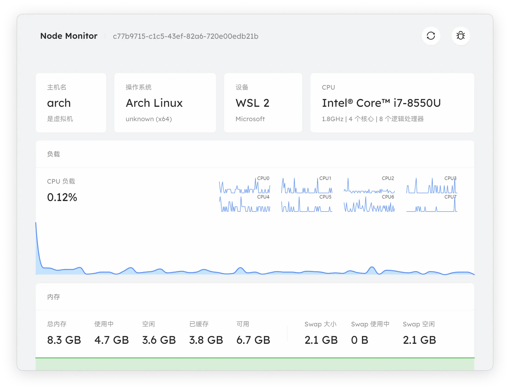
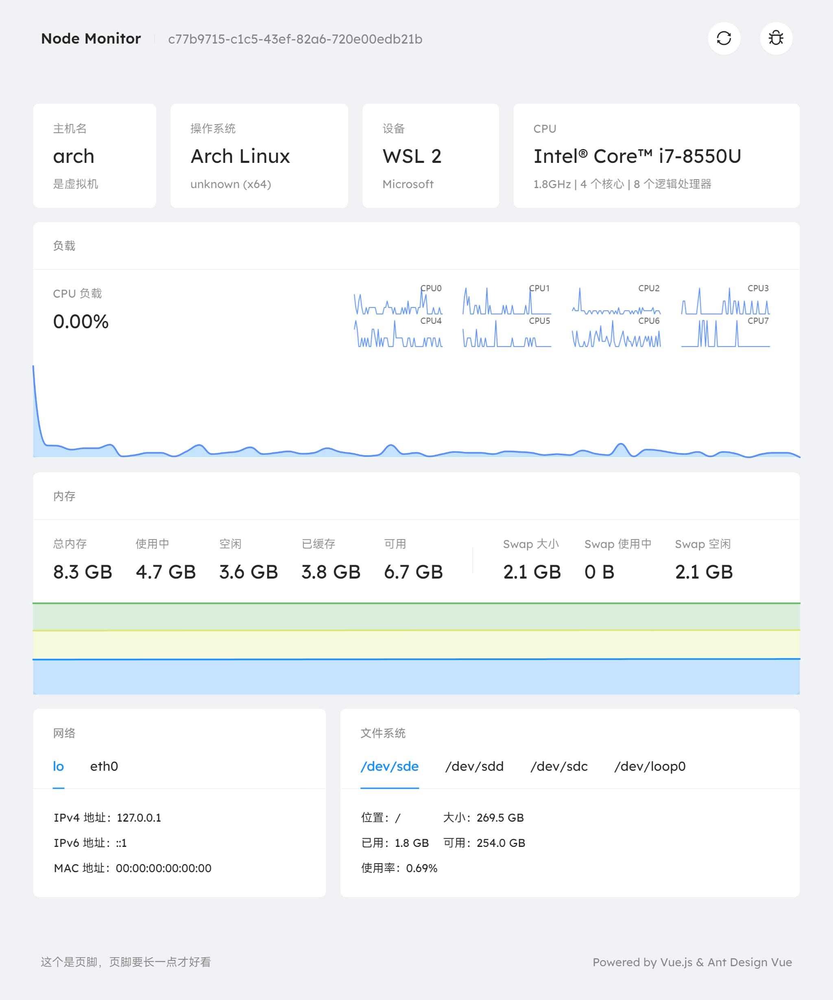

<p align="center">
  
</p>

<h1 align="center">Node Monitor</h1>

<p align="center">用 Node.js 和 Vue.js 做的系统信息收集程序</p>

<br />

## 项目结构

项目使用 [lerna](https://github.com/lerna/lerna) 来管理多个子项目，不同模块的详细信息进入子目录查看。

| 名称     | 说明                                   | 地址                                       |
| -------- | -------------------------------------- | ------------------------------------------ |
| 客户端   | 负责收集系统信息并发送给服务端         | [packages/client](./packages/client)       |
| 展示页面 | 负责读取并展示数据                     | [packages/dashboard](./packages/dashboard) |
| 服务端   | 负责将不同客户端的数据收集并存入数据库 | [packages/server](./packages/server)       |

## 截图




## 用的技术

开发工具：

- [**pnpm/pnpm**: Fast, disk space efficient package manager](https://github.com/pnpm/pnpm)
- [**lerna/lerna**: A tool for managing JavaScript projects with multiple packages.](https://github.com/lerna/lerna)
- [**TypeStrong/ts-node**: TypeScript execution and REPL for node.js](https://github.com/TypeStrong/ts-node)
- [**remy/nodemon**: Monitor for any changes in your node.js application and automatically restart the server - perfect for development](https://github.com/remy/nodemon)
- [**prettier/prettier**: Prettier is an opinionated code formatter.](https://github.com/prettier/prettier)

构建工具：

- [**evanw/esbuild**: An extremely fast JavaScript bundler and minifier](https://github.com/evanw/esbuild)
- [**vercel/pkg**: Package your Node.js project into an executable](https://github.com/vercel/pkg)
- [**docker/compose**: Define and run multi-container applications with Docker](https://github.com/docker/compose)

## 开发

安装依赖需要用到 pnpm 包管理工具。

```shell
pnpm i && pnpm run link
```

运行 `server` 模块时记得添加环境变量，用于连接数据库（或者直接使用 Docker Compose）。

## License

[MIT License](./LICENSE)
